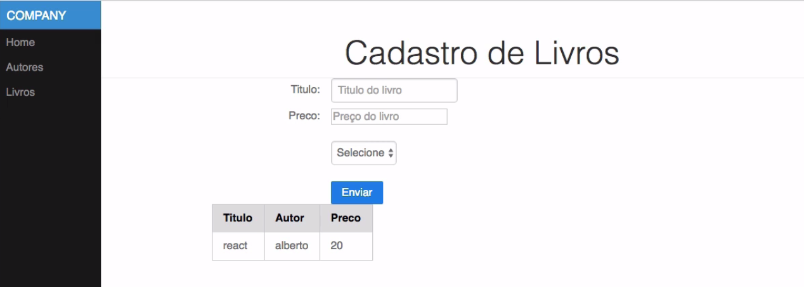

<!-- # Curso React - Alura -->
<div style="text-align: center; display:flex; align-items:center">
    <h1>Curso React - Alura</h1>
    
</div>

## Sobre o projeto

- Dois CRUDS. Cadastro de livros e cadastro de autores



## Noçoes básicas


## Como rodar

### Levantar Servidor


Levantar um servidor java (nao faz parte do curso, apenas para ter uma API que possa ser consumida)

O servidor pode ser baixado separadamente [aqui](https://bit.ly/jar-api-curso-react).

E o código disponível aqui [aqui](https://github.com/alberto-alura/cdcadmin-api)

```sh
cd server/
java -jar cdcreact-1.0.0-SNAPSHOT.jar
```

- Não está funcionando. Muitas pessoas reclamaram no forum
- A url do servidor é [http://cdc-react.herokuapp.com/api](http://cdc-react.herokuapp.com/api)


### Lado do Cliente

[Configuracao do sistema](configuracao_do_sistema.md)